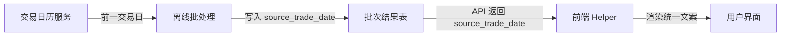

# Architecture

## 核心架构原则

1. 后端单写入通道：所有对 SQLite 的写操作必须在 backend 容器内完成，Admin/脚本不得绕开后端直接写库。
2. 离线任务 + 在线查询分离：数据产出由离线批处理完成，在线 API 只读已落盘结果。
3. 前端不持有业务日期逻辑：所有用户可见的日期语义由后端提供，前端只负责渲染。

## 批次级元数据体系

### source_trade_date

**定义**: 数据所基于的真实收盘交易日。与 `computed_at`（计算完成时间）严格区分。

**归属层级**: 批次级（batch-level）。同一批计算产出的所有结果共享同一个 `source_trade_date`。

**数据流**:

**核心规则**:
- 后端：每个日级收盘后批处理任务必须将 `source_trade_date` 作为批次元数据写入结果表。不得用 `computed_at` 减一天推算。
- 前端：所有用户主界面的日期展示统一使用 `source_trade_date`，由统一 helper 渲染。禁止直接使用 `computed_at` 或 `snapshot_date` 充当用户口径日期。
- 交易日历：A 股和港股各自维护交易日历，`source_trade_date` 必须按对应市场的交易日历查找前一交易日。

**已接入模块**:
- 风险机会全景图（象限）
- 卧龙 AI 精选排行榜
- 模拟组合当前成分股

**可复用模块**（未来接入）:
- 行业榜单
- 策略评分
- 因子快照
- 任何"日级收盘后产出"的策略/榜单/象限/组合

### 字段命名规范

| 场景 | 字段名 | 含义 |
|------|--------|------|
| 批次元数据 | `source_trade_date` | 数据基于的真实收盘交易日 |
| 计算完成时间 | `computed_at` | 离线任务计算完成的时间戳，仅供内部运维 |
| 快照写入时间 | `snapshot_date` | 快照落盘时间，不等于用户口径日期 |
