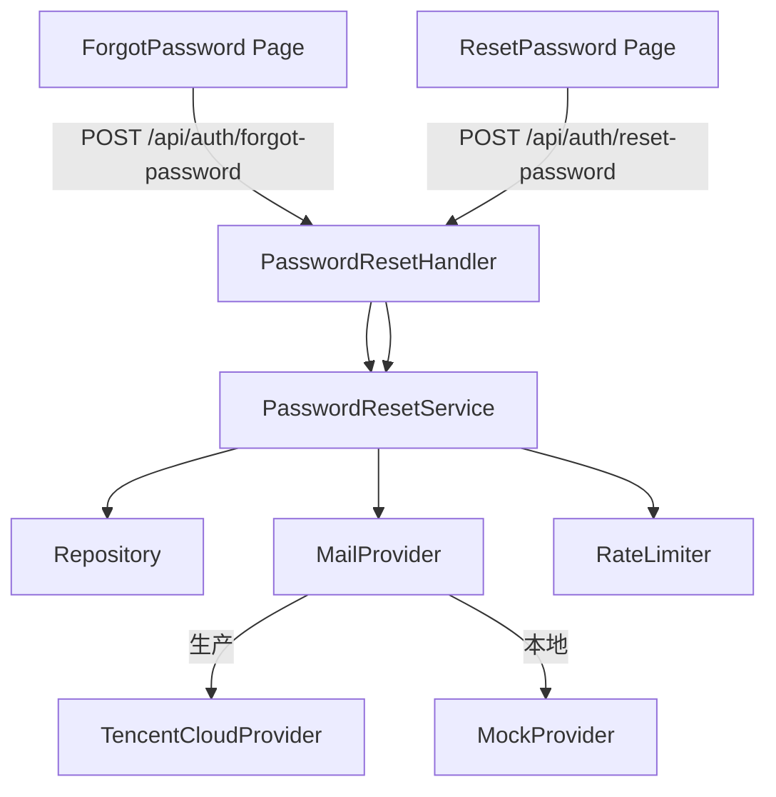

# 密码找回功能设计

## 1. 问题理解

### 需求复述

为邮箱登录系统增加密码找回能力：用户通过邮箱接收重置链接，点击后在新页面完成密码重置。重置成功后强制撤销所有已有 session。

### 歧义与信息缺失

- 已确认：本阶段不考虑用户失去邮箱控制权的情况
- 已确认：不使用 SMTP，使用腾讯云邮件推送 HTTP API
- 已确认：单实例部署，token 不需要分布式锁

## 2. 边界情况

| 场景 | 处理方式 |
|------|----------|
| 邮箱未注册 | 统一返回「如该邮箱已注册，我们将发送重置邮件」（不泄露注册信息） |
| 邮箱格式非法 | 400 INVALID_INPUT |
| 冷却期内重复申请 | 429 RATE_LIMITED，返回剩余冷却秒数 |
| IP 频率超限 | 429 RATE_LIMITED |
| 邮箱频率超限 | 429 RATE_LIMITED |
| Token 过期 | 410 TOKEN_EXPIRED |
| Token 已消费 | 410 TOKEN_CONSUMED |
| Token 不存在 | 404 TOKEN_NOT_FOUND |
| 两个标签页同时提交 | 第二个提交因 token 已消费而失败 |
| 新密码与旧密码相同 | 允许（简化实现，不增加密码历史） |
| 新密码长度不足 8 位 | 400 INVALID_INPUT |
| 邮件发送失败 | 后端记录审计日志，返回 500；不自动重试，用户可稍后重新申请 |
| 数据库事务失败 | 500，token 不被消费 |

## 3. 系统设计

### 模块划分

1. **PasswordResetService**（`backend/store/auth/`）
   - 职责：创建重置 token、验证 token、执行重置
   - 依赖：Repository、MailProvider

2. **MailProvider**（`backend/store/mail/`）
   - 职责：封装邮件发送能力，支持腾讯云 API 和本地 mock
   - 接口：`Send(ctx, to, subject, htmlBody, textBody) error`

3. **RateLimiter**（`backend/store/auth/`）
   - 职责：基于数据库记录的 IP / 邮箱频率限制

4. **PasswordResetHandler**（`backend/main.go`）
   - 职责：HTTP 路由处理，输入校验，调用 service

5. **ForgotPasswordPage**（`frontend/pages/forgot-password.js`）
   - 职责：输入邮箱，调用后端 API，展示发送结果

6. **ResetPasswordPage**（`frontend/pages/reset-password.js`）
   - 职责：输入新密码 + 确认密码，调用后端 API，展示结果

### 依赖关系



### 数据流

**发起找回**：
1. 用户输入邮箱 → 前端 POST `/api/auth/forgot-password`
2. 后端校验频率限制 → 创建 token → 写入 `password_reset_tokens` 表 → 调用 MailProvider 发送邮件 → 返回成功

**重置密码**：
1. 用户点击邮件深链 → 打开 `/reset-password?token=xxx`
2. 用户输入新密码 → 前端 POST `/api/auth/reset-password`
3. 后端校验 token → 事务内：更新密码 + 标记 token 已消费 + 撤销所有 session → 返回成功
4. 前端提示跳转登录

## 4. 数据结构 & 接口

### 核心数据结构

**password_reset_tokens 表**：

| 字段 | 类型 | 约束 | 说明 |
|------|------|------|------|
| id | VARCHAR(36) | PK | UUID |
| user_id | VARCHAR(36) | NOT NULL, INDEX | 关联用户 |
| token_hash | VARCHAR(64) | NOT NULL, UNIQUE | SHA-256(token)，避免明文存储 |
| expires_at | DATETIME | NOT NULL, INDEX | 过期时间 |
| consumed_at | DATETIME | NULLABLE | 消费时间，NULL 表示未消费 |
| ip | VARCHAR(64) | NOT NULL, DEFAULT '' | 申请者 IP |
| created_at | DATETIME | NOT NULL | 创建时间 |

**password_reset_rate_limits 表**：

| 字段 | 类型 | 约束 | 说明 |
|------|------|------|------|
| id | VARCHAR(36) | PK | UUID |
| key | VARCHAR(128) | NOT NULL, UNIQUE | `ip:{ip}` 或 `email:{email}` |
| count | INTEGER | NOT NULL, DEFAULT 0 | 当前窗口计数 |
| window_start | DATETIME | NOT NULL | 窗口起始时间 |
| created_at | DATETIME | NOT NULL | 创建时间 |
| updated_at | DATETIME | NOT NULL | 更新时间 |

### API 定义

**POST /api/auth/forgot-password**

请求：
```json
{
  "email": "user@example.com"
}
```

响应（成功或邮箱未注册均返回）：
```json
{
  "ok": true,
  "message": "如该邮箱已注册，我们将发送重置邮件"
}
```

错误响应：
- 429 RATE_LIMITED：`{ "code": "RATE_LIMITED", "detail": "请求过于频繁，请稍后再试", "retry_after_seconds": 45 }`

**POST /api/auth/reset-password**

请求：
```json
{
  "token": "raw-token-from-email-link",
  "new_password": "newpassword123"
}
```

成功响应：
```json
{
  "ok": true,
  "message": "密码重置成功，请重新登录"
}
```

错误响应：
- 400 INVALID_INPUT：密码长度不足
- 404 TOKEN_NOT_FOUND：token 不存在
- 410 TOKEN_EXPIRED：token 已过期
- 410 TOKEN_CONSUMED：token 已消费

### MailProvider 接口

```
MailProvider interface {
  Send(ctx context.Context, to string, subject string, htmlBody string, textBody string) error
}
```

### 腾讯云邮件推送 API 调用

- 接口：`SendEmail`（腾讯云邮件推送 HTTP API）
- 认证：TC3-HMAC-SHA256 签名（使用 SecretId + SecretKey）
- 请求域名：`ses.tencentcloudapi.com`
- Region：`ap-guangzhou`
- Version：`2020-12-29`

### 邮件深链格式

```
https://wolongtrader.top/reset-password?token={raw_token}
```

### 邮件模板

**HTML 版本**：
- 品牌：Wolong Trader
- 内容：重置密码提示 + 深链按钮 + 有效期说明 + 如果非本人操作则忽略提示
- 不含用户邮箱、用户名等敏感信息

**纯文本版本**：
- 同 HTML 的纯文本版，深链直接以 URL 文本呈现

## 5. 设计决策

### D-007: 密码重置使用数据库 token 而非 JWT

**决策**: 使用数据库存储的随机 token（SHA-256 哈希后存储），而非无状态 JWT。

**原因**:
- 需要支持「单次消费」语义，JWT 无法可靠地做到这一点（撤销列表增加复杂度）
- 需要支持频率限制，数据库记录天然支持
- 单实例部署，数据库 token 的性能开销可接受

**替代方案**: JWT — 无状态但无法可靠单次消费，且需要额外的黑名单机制。

### D-008: 邮件发送使用腾讯云邮件推送 API（非 SMTP）

**决策**: 使用腾讯云邮件推送 HTTP API，不使用 SMTP。

**原因**:
- HTTP API 更适合服务端调用，无需维护 SMTP 连接池
- 腾讯云 API 有完善的签名认证和错误码
- 不需要额外配置 SMTP 服务器参数

**替代方案**: SMTP — 更通用但需要维护连接，配置更复杂。

### D-009: 频率限制基于数据库而非内存

**决策**: 频率限制记录存储在 `password_reset_rate_limits` 表中。

**原因**:
- 单实例部署下内存方案也可行，但数据库方案更可靠（重启不丢失）
- 为未来多实例部署预留可能
- SQLite 写入性能足够支撑此场景

**替代方案**: Redis / 内存 map — 性能更好但增加依赖，当前规模不需要。

### D-010: 密码重置成功后撤销所有 session

**决策**: 重置密码成功后，在同一事务中撤销该用户所有有效 session。

**原因**:
- 密码已泄露的假设下，攻击者可能持有有效 session，必须一并撤销
- 用户体验上，重置密码后强制重新登录是业界标准做法

**替代方案**: 只撤销当前 session — 不够安全，其他 session 仍然有效。

### D-011: 本地开发使用 MockProvider

**决策**: 当 `MAIL_PROVIDER=mock` 时，MailProvider 实现为 MockProvider，邮件内容仅写入日志。

**原因**:
- 本地开发不应误发真实邮件
- MockProvider 将 token 和邮件内容输出到标准日志，便于调试
- 零外部依赖，无需配置腾讯云密钥

## 6. 扩展性设计

### 可扩展点

1. **MailProvider 接口**: 未来可接入其他邮件服务商（SendGrid、Mailgun 等），只需实现 `MailProvider` 接口
2. **频率限制存储**: 可从 SQLite 切换到 Redis，Repository 接口不变
3. **Token 存储后端**: 可从 SQLite 切换到 Redis，实现 TTL 自动过期清理
4. **客服政策**: 未来可增加「用户失去邮箱控制权」的人工验证流程

### 演进路径

1. Phase 1（当前）: 邮箱找回密码 + 腾讯云邮件推送 + mock provider
2. Phase 2: 增加 Admin 后台查看重置请求统计
3. Phase 3: 支持其他登录方式（手机号等）的找回流程

## 7. UI/UX 设计

### 信息架构

```
登录弹窗
  └─ 「忘记密码？」链接 → /forgot-password
/forgot-password（发起找回页）
  └─ 输入邮箱 → 发送成功提示
/reset-password?token=xxx（重置密码页）
  └─ 输入新密码 + 确认密码 → 重置成功 → 跳转登录
```

### 核心页面设计

**PC 端 — /forgot-password**：
- 居中卡片布局，与登录弹窗视觉风格一致
- 标题：「找回密码」
- 副标题：「输入注册邮箱，我们将发送重置链接」
- 输入框：邮箱
- 按钮：「发送重置邮件」
- 底部：返回登录链接
- 状态：loading / 成功（显示绿色提示卡片）/ 错误

**PC 端 — /reset-password**：
- 居中卡片布局
- 标题：「重置密码」
- 输入框：新密码 + 确认密码
- 按钮：「重置密码」
- 底部：返回登录链接
- 状态：loading / 成功（显示绿色提示 + 跳转登录按钮）/ token 无效（显示红色提示 + 返回找回页按钮）

**移动端**：
- 与 PC 端相同布局，自适应宽度
- 单列卡片，全宽输入框
- 触摸友好的按钮尺寸

### 关键交互流程

1. 登录弹窗中点击「忘记密码？」→ 跳转 /forgot-password
2. 输入邮箱 → 点击「发送重置邮件」→ 显示发送中状态
3. 发送成功 → 显示绿色提示「重置邮件已发送到您的邮箱，请查收。链接 30 分钟内有效。」
4. 用户打开邮箱 → 点击深链 → 跳转 /reset-password?token=xxx
5. 输入新密码 + 确认密码 → 点击「重置密码」→ 显示重置中状态
6. 重置成功 → 显示绿色提示「密码重置成功」+ 跳转登录按钮
7. 点击跳转登录 → 打开登录弹窗

### 状态设计

- **loading**: 按钮显示「发送中...」/「重置中...」，禁用按钮
- **error**: 红色错误卡片
- **success**: 绿色成功卡片
- **token-invalid**: 红色提示 + 引导用户重新发起找回

## 8. 风险评估

### 性能

- 密码重置是低频操作，SQLite 完全可承受
- 邮件发送是外部调用，需设置超时（建议 10s）

### 并发

- 同一 token 并发提交：数据库原子更新 `consumed_at` 保证只有一个成功
- 同一邮箱并发申请：频率限制表 `key` 唯一索引 + 原子更新保证计数正确

### 数据一致性

- 密码更新 + token 消费 + session 撤销在同一事务中，保证原子性
- 事务失败时 token 不被消费，用户可重试

### 技术债风险

- `password_reset_rate_limits` 表需要定期清理过期记录，否则会持续增长。建议在 `RateLimiter` 中对过期窗口自动重置计数
- `password_reset_tokens` 表中过期未消费的记录需要定期清理，可由后台定时任务完成

## 9. 配置项

| 环境变量 | 说明 | 默认值 |
|----------|------|--------|
| `APP_PUBLIC_BASE_URL` | 前端公共访问域名，用于构建邮件中的重置深链 | `https://wolongtrader.top` |
| `MAIL_PROVIDER` | 邮件发送提供商：`tencent_cloud` 或 `mock` | `mock` |
| `MAIL_FROM_EMAIL` | 发件人邮箱地址 | `no-reply@wolongtrader.top` |
| `MAIL_FROM_NAME` | 发件人显示名称 | `Wolong Trader` |
| `MAIL_API_KEY` | 腾讯云 SecretId（当 MAIL_PROVIDER=tencent_cloud 时必填） | 空 |
| `MAIL_API_SECRET` | 腾讯云 SecretKey（当 MAIL_PROVIDER=tencent_cloud 时必填） | 空 |
| `MAIL_REGION` | 腾讯云 API Region | `ap-guangzhou` |
| `PASSWORD_RESET_TTL_MINUTES` | 重置 token 有效期（分钟） | `30` |
| `PASSWORD_RESET_RATE_LIMIT_PER_IP` | 同一 IP 每小时最大请求次数 | `10` |
| `PASSWORD_RESET_RATE_LIMIT_PER_EMAIL` | 同一邮箱每小时最大请求次数 | `3` |
