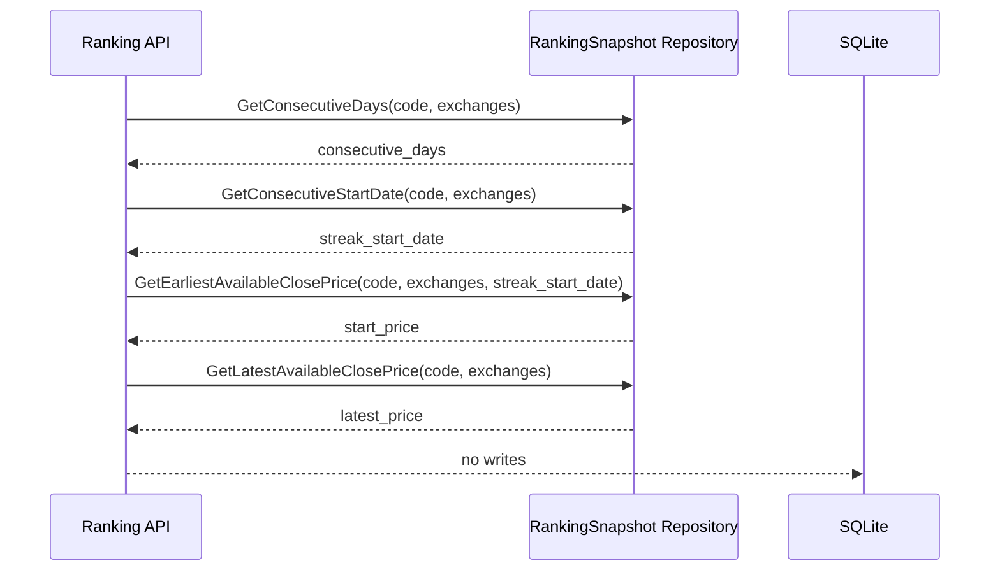

# Design: 卧龙 AI 精选排行榜涨幅口径

## 模块划分

### 1. 快照连续周期查询

- 职责：从 `quadrant_ranking_snapshots` 中按 `snapshot_date DESC` 读取某股票的历史上榜日期。
- 输出：当前连续上榜周期的起始 `snapshot_date`。
- 规则：从最新日期开始逐日向前追溯；遇到日期断档即停止。

### 2. 排行榜 API 组装

- 职责：构造 `RankingItem` 时填充 `consecutive_days` 和 `return_pct`。
- 规则：`consecutive_days` 与 `return_pct` 使用同一个连续周期窗口。
- 计算：`return_pct = (latest_price - start_price) / start_price * 100`。

### 3. 历史快照价格修复

- 职责：修复 `quadrant_ranking_snapshots` 中缺失或错误的收盘价。
- 实现：复用 `backend/cmd/backfill-ranking-snapshots`，新增 `--refresh-existing` 支持刷新已有正价格。
- 原则：历史数据修复由显式运维命令执行，不由普通 API 读取路径自动修改。

## 数据流

## 边界情况

- 最新快照只有 1 天：起点为最新快照；有价格时 `return_pct=0`。
- 周期起点快照无价格：向后取周期内最早可用正价格。
- 最新快照无价格：向前取最新可用正价格。
- 全部无价格：`return_pct=null`。
- 历史更早的断档前快照不参与当前周期涨幅。
