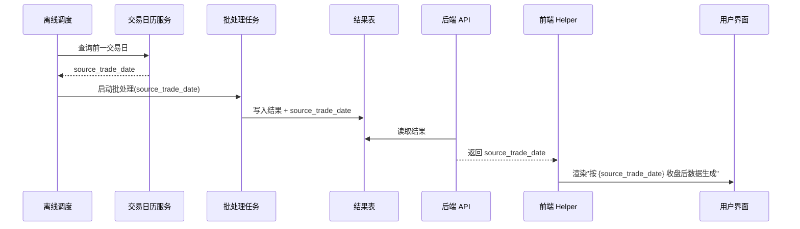

# Design: source_trade_date 统一展示

## 模块划分

### 1. 交易日历服务（后端）

- 职责：按市场（A 股/港股）查询前一交易日。
- 依赖：市场交易日历数据源。
- 输出：给定日期，返回该市场的前一交易日。

### 2. 批次元数据写入（后端）

- 职责：离线批处理启动时，从交易日历服务获取 `source_trade_date`，写入批次结果表。
- 依赖：交易日历服务。
- 输出：结果表新增 `source_trade_date` 字段。

### 3. API 层（后端）

- 职责：在响应中返回 `source_trade_date`，供前端渲染。
- 依赖：结果表。
- 输出：API 响应顶层或批次级包含 `source_trade_date`。

### 4. 日期渲染 Helper（前端）

- 职责：将 `source_trade_date` 统一渲染为 `按 {date} 收盘后数据生成`。
- 依赖：API 返回的 `source_trade_date`。
- 输出：统一文案字符串。

## 数据流

## 涉及修改的 3 个位置

1. **风险机会全景图**：数据日期从 `computed_at` 改为 `source_trade_date`，文案改为 `按 {source_trade_date} 收盘后数据生成`。
2. **卧龙 AI 精选排行榜**：同上。
3. **模拟组合当前成分股**：当前已显示"按 {date} 收盘后榜单生成"，但 date 取自排行榜的计算时间而非真实收盘日；改为使用 `source_trade_date`。

## 设计决策

见 D-005（decisions.md）。
